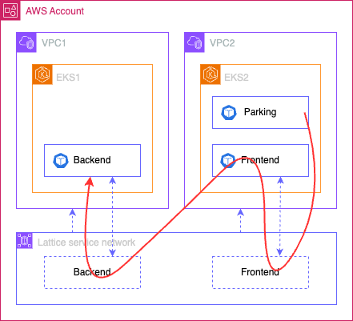

# Intro
Multi-cluster, multi-account integration with K8S and Istio is not trivial.  
The goal of this prototype is to experiment with Lattice and EKS.  

It comes with 2 scripts.  
setup.sh script is creating the resources.  
cleanup.sh script is cleaning the resources.  

The prototype:
- deploys 2 clusters, 
- configure them to connect with Lattice using a dedicated gateway,
- deploy a backend service in one cluster,
- deploy a frontend service calling the backend service in the other cluster,
- create a Lattice service network and associate it with the 2 VPCs where the clusters are deployed, 
- define a route for the two services with the Lattice gateway, this create the service association in the service network, 
- each service gets a Lattice domain name, private, so I deployed a parking container I can connect to to simulate a call to the services. The domain name is looking like `frontend-route-default-02c9db9697ce1e434.7d67968.vpc-lattice-svcs.us-east-1.on.aws` and you can test it using a command like `kubectl exec deploy/parking -- curl frontend-route-default-02c9db9697ce1e434.7d67968.vpc-lattice-svcs.us-east-1.on.aws`

Architecture diagram:  

# Notes
- At the moment a process is calling regularly the services. This is probably Lattice health checks configured by default to hit the root URL. The services expose a /live service for health checks I should reconfigure the Lattice service associations.  
- There's a way to associate the services with a custom domain name, easier to remember, something like frontend.mymesh.com. To be tested.
